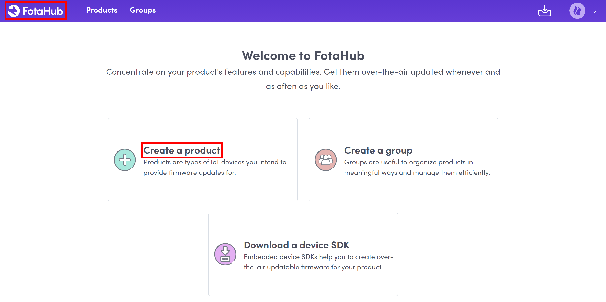
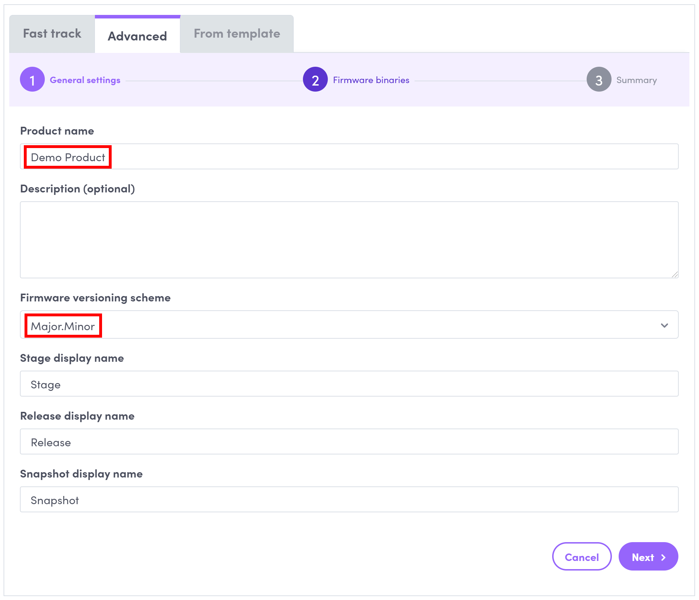
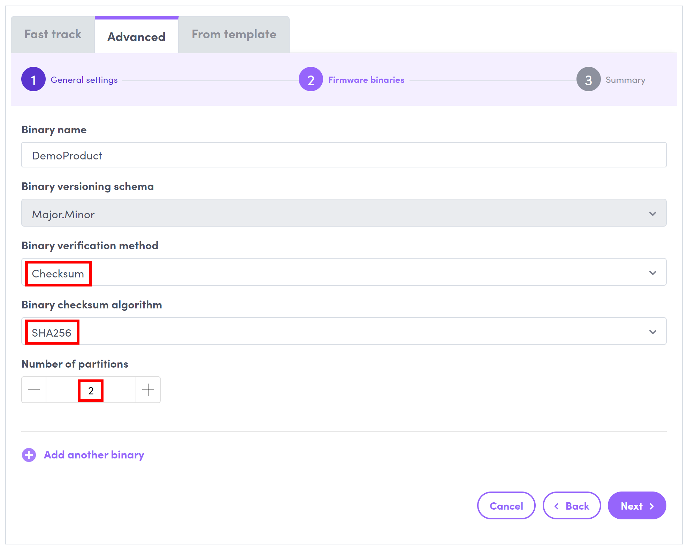

# How to create a simple FotaHub product for your ESP8266 device or board

1. Go to [FotaHub](https://fotahub.com), and sign in with your existing account or sign up for a one if you don't have any yet.

2. Click on the FotaHub logo in the title bar, and then on `Create a product`:

     

3. In the product creation wizard, select the `Advanced` mode. Enter the name of your product and select the versioning scheme you want to use for your firmware versions. Optionally, you can also add a description for your product. Leave the other fields at their defaults and click on `Next`.

    
   
4. Choose the binary verification method and algorithm your device or board uses to verify new firmware versions downloaded from FotaHub before applying them. To begin with, simply choose the value matching the default configuration of the FotaHub Device SDK examples as per below. Also set the number of partitions to `2` to honor the fact that firmware updates for the ESP8266 always consist of two firmware binaries which contain the same code but are located to two different partitions in the ESP8266's flash memory:

    

5. Click on `Next` and then on `Create` to finalize the creation of your FotaHub product.