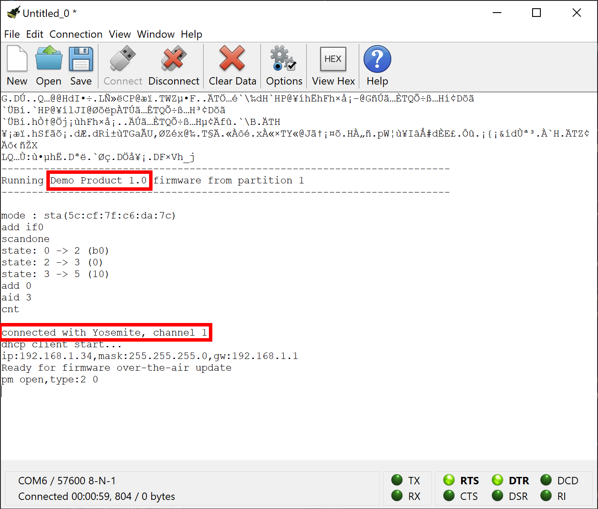
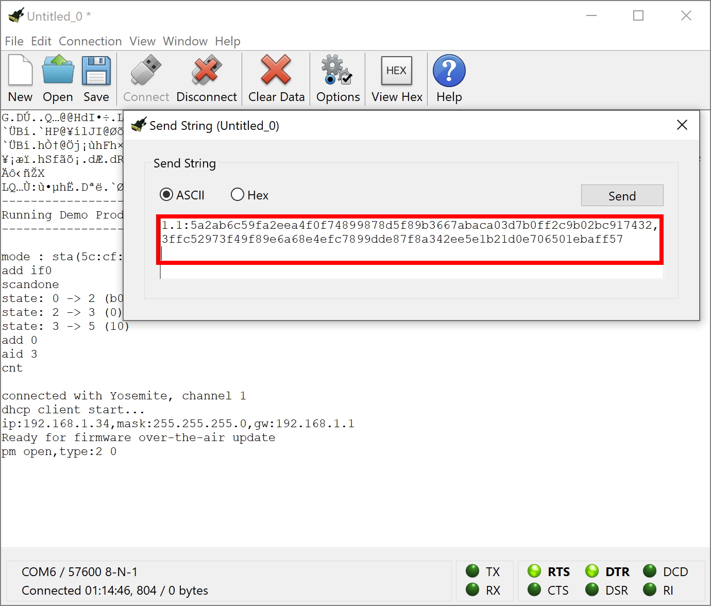
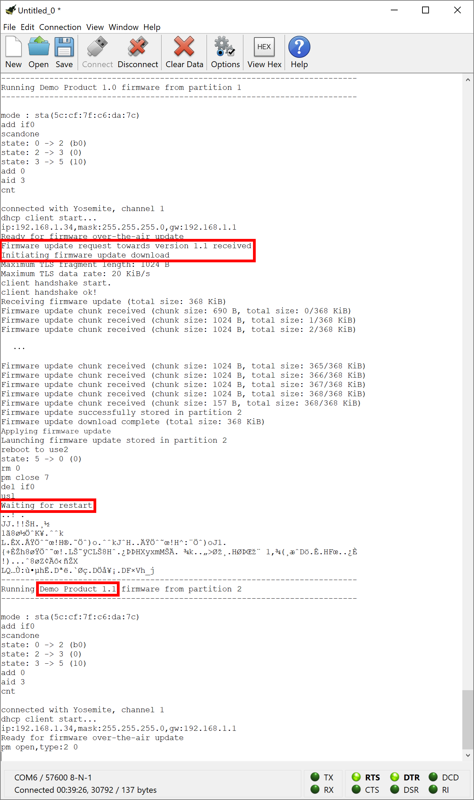

# Simple FOTA update example

The *Simple* example demonstrates the most straight forward manner to make firmware over-the-air updates with FotaHub. It is kind of a "Hello World" example for FOTA updating and a perfect way to get started in that field.

## Operating principle

The device listens for a firmware update info string to be sent over the serial port. It is expected to start with the new firmware version the device should be updated to followed by a ':' separator and the checksum or signature data for the new firmware version. As firmware updates for the ESP8266 always consist of two firmware binaries which contain the same code but are located to two different partitions in the ESP8266's flash memory, the update info string is required to include the checksums or signatures of both of these firmware binaries and a ',' spearator between the two:

`<new-version>:<verification-data-partition-1,verification-data-partition-2>` 

For example:

 `1.1:9fac9b21437c869229ea0f5296d8a5abc92e54a9d627790667ab1f652a515e66,9db15800e3c951ead25b5aa7c9238e6d170c1824887fbc7b3c82b9e6a901e983`

Once a valid update info string has been received and the contained new firmware version is different from the version of the firmware already running on the device, the firmware update procedure is triggered. It involves the device to determine in which partition the currently executing firmware version is located, and then to connect to FotaHub to download the binary of the new firmware version that is located to the other partition. Thereby, it uses a dedicated URL including the id of the product representing the device in FotaHub, and the name, the version and the partition index of the firmware binary to be retrieved, e.g.:

`https://bin.fotahub.com/6258c080-85f6-4a7a-84a2-7a9ef16d03fc/DemoProduct-1.1@1`

The downloaded firmware binary is stored in the device's flash memory using the partition that is not occupied by the still executing firmware version. At the same time, the downloaded firmware binary's checksum or signature gets recalculated and compared to the corresponding checksum or signature included in the previously communicated update info string. If both match, the firmware update gets activated by restarting the device and letting boot it into the partition where the downloaded firmware binary has been stored. After the restart, the device executes the new firmware version downloaded from FotaHub. 

## Supported targets

The Simple example can be used as is with the [Adafruit Feather HUZZAH](https://learn.adafruit.com/adafruit-feather-huzzah-esp8266) board. With some adaptations, it can also be used with any other ESP8266 development board or hardware product.  

## Installation

A description of the SDKs and tools that must be available on your laptop or computer and advise how to install them can be found [here](../../README.md#installation).

## Usage

### Create a FotaHub product

Create a FotaHub product that represents your board in FotaHub as explained [here](../fotahub/create-product.md). It will be used to upload and provide firmware updates for the same. 

### Get the FotaHub Device SDK for ESP8266

If not yet done so, either clone or download and uncompress the [FotaHub Device SDK for ESP8266](https://github.com/fotahub/fotahub-device-sdk-esp8266) to a location of your choice on your machine. 

> &#x26A0; Make sure that the path to the location of the FotaHub Device SDK for ESP8266 on your machine does not contain any spaces.

### Create and run initial firmware version

1. Start the Visual Studio Code and open (`File > Folder...`) the `Simple` example included in the FotaHub Device SDK for ESP8266 (`<device-sdk-root>/examples/huzzah/simple`).

2. Go to the `user_config.c` file and initialize the `WIFI_STATION_SSID` and `WIFI_STATION_PASSPHRASE` variables with the credentials of the Wi-Fi network you want to connect to with your board:

```c
ICACHE_RODATA_ATTR
char const WIFI_STATION_SSID[] = "my-fancy-WiFi-SSID";

ICACHE_RODATA_ATTR
char const WIFI_STATION_PASSWORD[] = "my-cryptic-WiFi-passphrase";
```

3. Open the `DemoProductInfo.c` file and initialize the `DEMO_PRODUCT_ID` and `DEMO_PRODUCT_NAME` variables with the id and the name of the previously created FotaHub product (see `Products > {{Your FotaHub product}} > Settings > General` at [Fotahub](https://fotahub.com)). Leave the `DEMO_PRODUCT_FIRMWARE_VERSION` as is for now:

```c
ICACHE_RODATA_ATTR
char const DEMO_PRODUCT_ID[] = "6258c080-85f6-4a7a-84a2-7a9ef16d03fc";

ICACHE_RODATA_ATTR
char const DEMO_PRODUCT_NAME[] = "Demo Product";

ICACHE_RODATA_ATTR
char const DEMO_PRODUCT_FIRMWARE_VERSION[] = "1.0";
```

<p style="margin-left: 2em">In case you have selected anything else than <code>SHA256</code> as the binary checksum algorithm for your FotaHub product or opted for using a signature instead, you also must adjust the <code>DEMO_PRODUCT_FIRMWARE_UPDATE_VERIFICATION_ALGORITHM</code> variable in the <code>DemoProductInfo.h</code> file accordingly:

```c
#define DEMO_PRODUCT_FIRMWARE_UPDATE_VERIFICATION_ALGORITHM FOTA_UPDATE_VERIFICATION_ALGORITHM_SHA256
```

4. Open the integrated terminal (`Terminal > New Terminal`) and build the example by running `make`.
    
    When you have opted to use the ESP8266 NONOS SDK and ESP8266 toolchain through Docker, `make` must be run inside a Docker container providing the same. You can achieve that conveniently by making sure that Docker is running on your machine and invoking the `mind.bat`/`mind.sh` (**M**ake **IN** **D**ocker) script according to your operating system:
   
**Windows:**   
```bat
mind
```
**Linux/Mac OS X:**   
```sh
./mind.sh
```
<p style="margin-left: 2em">If you have installed the ESP8266 NONOS SDK and ESP8266 toolchain directly on your machine, you can invoke <code>make</code> right away but must indicate the ESP8266 NONOS SDK install or checkout location by setting the <code>SDK_HOME</code> variable. Be sure that this location does not contain any spaces in its path and specify it as <a href="https://cygwin.com/cygwin-ug-net/using.html#using-pathnames">Cygwin POSIX-style path name</a> when working under Windows (e.g., <code>/c/Git/ESP8266_NONOS_SDK</code> instead of <code>C:\Git\ESP8266_NONOS_SDK</code>):</p> 

```bat
make SDK_HOME=<ESP8266 NONOS SDK install/checkout location>
```

5. Connect your board to your laptop or computer using a USB cable, and identify the corresponding serial port (a guide explaining how to do so with ESP32 boards but applies to ESP8266 boards as well can be found [here](https://docs.espressif.com/projects/esp-idf/en/latest/esp32/get-started/establish-serial-connection.html)).

> &#x26A0; It may happen that you are unable to find the serial port your board is connected to. Most of the time this is because the device driver for the USB to serial converter chip of your board is missing. You can fix that by manually installing the same as explained [here](../../README.md#general-purpose-tools).

6. Flash the firmware binary that has resulted from building the example to your board.
   
   If you have used Docker and `mind` to build the firmware binary, you will notice that two new scripts, namely `flash.bat`/`flash.sh` and `erase.bat`/`erase.sh` have been created along the way. Use the first one to flash the firmware binary to your board and provide the serial port it is connected to as argument:

**Windows:**   
```bat
flash <COM port name, e.g., COM3>
```
**Linux/Mac OS X:**   
```sh
./flash.sh <serial port name, e.g., /dev/ttyUSB0>
```

<p style="margin-left: 2em">If you have built the firmware binary with <code>make</code> and the ESP8266 NONOS SDK and ESP8266 toolchain installed on your machine, invoke <code>make flash</code> to flash the firmware binary to your board. Indicate the ESP8266 NONOS SDK install or checkout location and serial port your board is connected to by setting the <code>SDK_HOME</code> and <code>ESPTOOL_COM_PORT</code> variables:</p> 

```bat
make flash SDK_HOME=<ESP8266 NONOS SDK install/checkout location> ESPTOOL_COM_PORT=<COM or serial port name, e.g., COM3 or /dev/ttyUSB0>
```

7. Start your serial monitor app, point it at the serial port your board is connected to, and set the baudrate to `57600` (`Connection > Options...` in CoolTerm). Open the configured serial port (`Connection > Connect` in CoolTerm), observe how the firmware starts up and verify whether it connects to the Wi-Fi network:



<p style="margin-left: 2em">Also have a look at the red LED next to the USB port on your board (GPIO #0). It should blink with a period of approx. 1 s.</p> 

### Create and upload a new firmware version to FotaHub

1. Go back to the `DemoProductInfo.c` file and bump the value of the `DEMO_PRODUCT_FIRMWARE_VERSION` variable:

```c
ICACHE_RODATA_ATTR
char const DEMO_PRODUCT_FIRMWARE_VERSION[] = "1.1";
```

2. *Optional:* Make another change in your firmware, e.g., increase the blink frequency of the red LED on your board by going back to the `user_config.h` file and decreasing the value of the `BLINK_PERIOD` constant:

```c
#define BLINK_PERIOD 250
```

3. Rebuild the example using Docker and `mind` or `make` in very much the same way as you did for building the initial firmware version (see step 4 in the previous section). Locate the resulting new firmware binary files named `DemoProduct1.bin` and `DemoProduct2.bin` in the `build/bin` folder (using the `Explorer` view).
   
> &#x1F6C8; You can locate the new firmware binary files also in your file system explorer or copy their paths to the clipboard using corresponding Visual Studio Code context menu actions (`Reveal in File Explorer` and `Copy Path`). This can come quite handy in the subsequent steps.

4. Upload the new binaries (`build/bin/DemoProduct1.bin`, `build/bin/DemoProduct2.bin`) as firmware version `1.1` to your FotaHub product as explained [here](../fotahub/upload-firmware.md).

### Make your first firmare over-the-air update 

1. Go back to the serial monitor app showing the execution status of your board running the initial firmware version. Enter the new firmware version followed by a ':' separator, the checksum or signature of the first firmware partition, a ',' separator, and the checksum or signature of the second firmware partition (see `Products > {{Your FotaHub product}} > Details > {{New firmware version}}` at [Fotahub](https://fotahub.com)). Also append a terminating line break in the text field or dialog provided for sending data over the opened serial port (`Connection > Send String...` in CoolTerm):

 

> &#x1F6C8; In most cases, your serial monitor app can be configured to automatically terminate all strings being sent with a line break so that you can't forget to do so manually upon every submission (`Connection > Options... > Transmit > Send String Options > Terminate 'Send String' Data` in CoolTerm).

2. Submit the firmware update info string to your board (`Send` button in CoolTerm). This will trigger the firmware over-the-air update procedure. Upon successful completion, the board will be restarted with the new firmware version downloaded from FotaHub. To verify that, check the firmware version in the banner showing up in the serial monitor output:

 

<p style="margin-left: 2em">In case that the new firmware version includes the change wrt to the blink frequency of the red LED on your board as mentioned above, you should also see that the latter is blinking significantly faster now.</p>